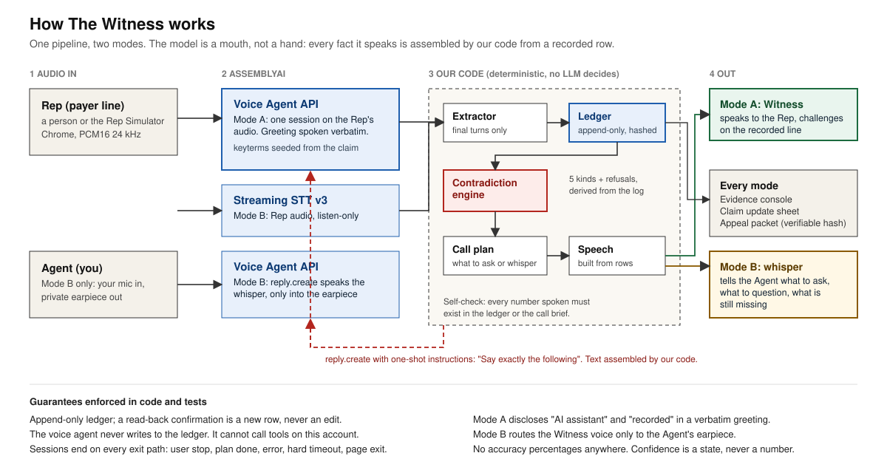
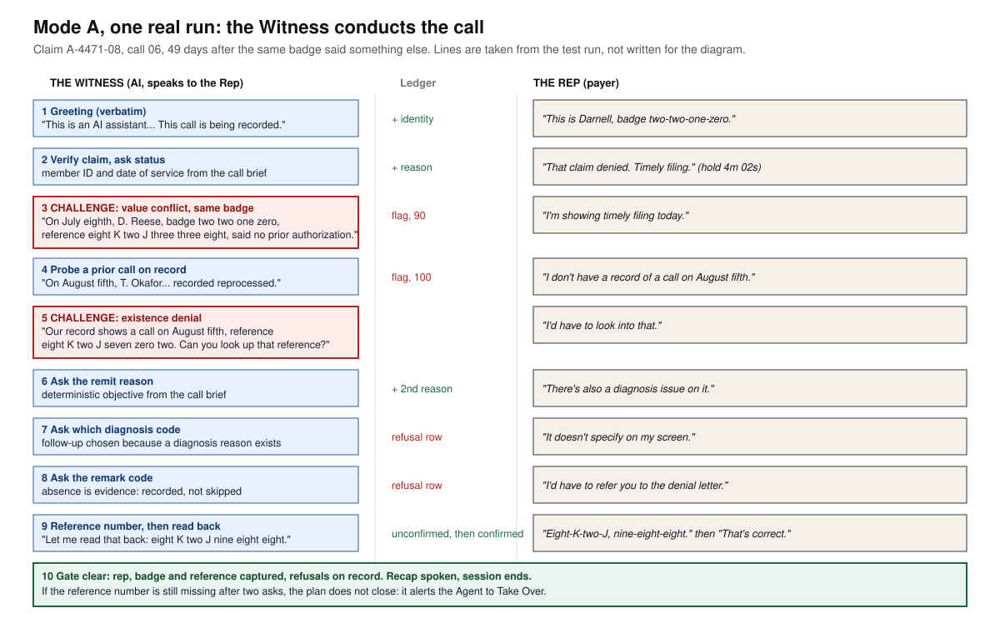

# The Witness

**Payer call memory.** A voice agent that rides along on the insurance call a medical biller is already making, captures what the payer said as a timestamped record, and speaks up mid-call the moment the payer contradicts something it said on an earlier call about the same claim.

> We don't predict what the payer will pay. We record what the payer said.

**Live demo:** https://the-witness-qynnmygc0-chris-velezs-projects.vercel.app (deploy pending the latest build) · **Built on:** AssemblyAI Streaming STT v3 + Voice Agent API · **Submission:** AssemblyAI Voice Agent Hackathon, Sep 2026

---

## The problem

A biller spends **25 minutes and $13.80** on one phone call asking a payer why a claim was denied.<sup>[1]</sup> The answer is spoken, unrecorded on the provider's side, and gone the moment they hang up — compressed into a line of shorthand in a claim note. Three weeks later a different representative gives a different answer, and nothing in the revenue cycle notices.

The last federal measurement of payer call-center accuracy found representatives giving *inconsistent responses within the same call center*.<sup>[2]</sup> It was published in 2006. No modern measurement exists, because no instrument exists.

Meanwhile roughly 15% of claims are denied, **under 1%** of denied in-network ACA claims are ever appealed, and most appeals that are filed get overturned.<sup>[3]</sup> The gap between those numbers isn't merit. It's evidence: appealing means reconstructing what the payer actually said, and nobody can.

**The Witness creates that record while the call is happening.**

---

## Why this is an AssemblyAI problem specifically

The hardest thing in this product and the reason the agent has to *speak* are the same thing.

Spoken alphanumerics are a documented frontier failure — roughly a third of spoken phone numbers are missed even by the best models. Reference numbers *are* that problem. Two moves solve it, and both are AssemblyAI-shaped:

1. **Seed keyterms with the claim's own numbers** before the call starts, collapsing open-vocabulary transcription into candidate matching.
2. **When confidence lands below threshold, the agent speaks a readback prompt** instead of guessing — *"I heard eight-K-two-J-nine-one-five. Ask them to repeat it."*

Nothing else in the stack can be swapped out for this. The transcription difficulty is what creates the need for a voice agent.

---

## How it works

One pipeline, two modes. The person using The Witness is the **Agent**; the person at the payer is the **Rep**.

- **Mode A, the Witness speaks.** The Agent fills in a call brief (claim, member, what they need answered). The Witness conducts the call: it says up front that it is an AI assistant and that the call is recorded, works through the brief, **challenges the Rep on the recorded line** when the Rep contradicts something already on record, reads reference numbers back, and only finishes when the hang-up gate is clear.
- **Mode B, Copilot.** The Agent speaks to the Rep. The Witness listens and **whispers** into the Agent's earpiece what to ask, what to question, and what is still missing.
- **Take over** switches from A to B in the middle of a call.



### One real run of Mode A

Same claim. Same representative. Forty-nine days apart. The steps below are taken from the automated test run of the scripted call, not written for the diagram.



### What the agent is, and is not

The agent is a **mouth, not a hand.** Contradiction detection is deterministic and runs in our own code. The agent never writes to the ledger and never decides what is true: the call plan decides what happens next, and every sentence that carries a fact is assembled from a recorded statement. A self-check compares every number the agent actually says against the ledger and the call brief.

This is a deliberate constraint, not a limitation we backed into: every evidence-bearing utterance can be traced to a row a human can play back. The ledger is append-only and hash-chained, so the appeal packet can be verified against the log.

---

## Quickstart

**Prerequisites:** Node 20+, an AssemblyAI API key, and Chrome (dual-channel browser audio capture is Chromium-only).

```bash
git clone https://github.com/<your-user>/the-witness.git
cd the-witness
npm install

cp .env.example .env      # then paste your key into .env
npm run dev
```

Open <http://localhost:3000>. You should see the holding console reading **SYSTEM READY · NO SESSION**.

> **Never auto-connect.** Sessions start on an explicit click. The account allows 5 new streams per minute and this app opens two per call — a hot-reload loop that reconnects on save will trip the limit and present as a connection bug.

### Configuration

| Variable | What it is | Required | Default |
|---|---|:--:|---|
| `ASSEMBLYAI_API_KEY` | Server-side only. Never sent to the browser — the client gets a short-lived token from `/api/token`. | Yes | — |
| `ASSEMBLYAI_STT_MODEL` | Speech model, pinned explicitly. | Yes | `universal-3-5-pro` |
| `ASSEMBLYAI_AGENT_LLM` | Agent LLM, pinned explicitly. Never rely on default resolution — the default may resolve to a model the account cannot reach, and it fails looking like a connection error. | Yes | `qwen3.5-4b-fast` |
| `SESSION_MAX_SECONDS` | Hard ceiling per session. Billing is on socket-open duration, so every session must be able to kill itself. | Yes | `900` |

---

## Project structure

```
src/app/          Next.js routes. Pages and API handlers only — no business logic.
  api/token/      Mints short-lived tokens. The only place the API key is read.
src/domain/       Pure rules: statements, claim ledger, contradiction types. No I/O.
src/services/     The outside world: AssemblyAI clients, audio capture, storage.
src/ui/           React components. Props in, pixels out. Never calls an API.
src/lib/          Small shared helpers with no domain meaning.
fixtures/         Scripted demo corpus — call scripts, audio, expected records.
docs/             Architecture, decisions, compliance notes.
tests/            Mirrors src/ path for path.
```

The rules are machine-readable in [`.repo-layout.yml`](.repo-layout.yml) and explained in [`docs/ARCHITECTURE.md`](docs/ARCHITECTURE.md). **Read them before adding a file.**

---

## Status

| Area | State |
|---|---|
| Research and planning | Complete |
| Technical spikes | Complete: both resolved — agent-initiated speech confirmed, audio capture path decided |
| Repo + deploy shell | In progress |
| Dual AssemblyAI sessions | Not started, week A |
| Claim ledger + contradiction engine | Not started, week B |
| Two-timescale evidence console | Not started, week B |
| Close-Out + appeal packet | Not started, week C |

**Known constraints, stated up front:** Chrome-only (dual-channel capture is Chromium-only, and macOS needs 14.2+ with Chrome 141+). The demo corpus is scripted text-to-speech — **no protected health information touches this project.** No accuracy percentage is claimed anywhere, by policy.

---

## Sources

1. CAQH Index, 2024 — time and cost per phone claim-status transaction.
2. GAO-06-710 — 900 test calls; representatives gave inconsistent responses.
3. KFF analysis of ACA and Medicare Advantage appeal and overturn rates.

Legal framing for the appeal packet rests on the **US Department of Labor / EBSA Information Letter of June 14, 2021**, which holds that under 29 CFR 2560.503-1(h)(2)(iii) audio recordings and transcripts of conversations with plan representatives are relevant documents a plan must produce. The regulation assumed such records exist. For providers, they mostly do not. This creates them.

The Witness is leverage inside a payer's own internal appeal. It is not a litigation instrument.

## License

MIT — see [LICENSE](LICENSE).


---

## Status and how to run it

```bash
npm install
cp .env.example .env      # add ASSEMBLYAI_API_KEY (live path only)
npm run dev               # http://localhost:3000
npm test && npm run typecheck && npm run lint
```

- **Scripted path (no key, no mic, no network):** open `/`, press **Start call**. Choose *Witness speaks* (the AI conducts the call and challenges the rep) or *Copilot* (you speak, the Witness whispers). **Take over** switches mid-call. `/packet` is the appeal packet.
- **Live path:** choose *Be the Rep (live)*, press **Start live call**. You speak as the payer rep; the Witness calls you through the AssemblyAI Voice Agent API. Chrome, headphones, a microphone and a server key are required. One session opens only when you press Start and is ended on every exit path.
- Everything spoken by the Witness is assembled from recorded statements and checked against the record; nothing is inferred. All demo data is synthetic. No PHI.
