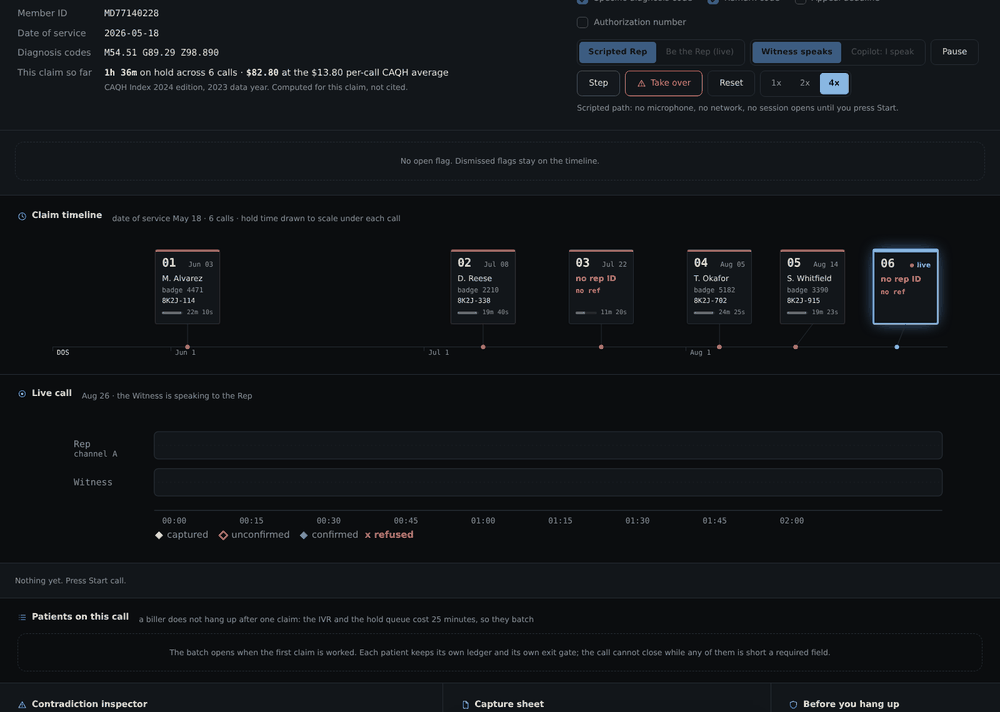

# The Witness

**Payer call memory.** A voice agent that rides along on the insurance call a medical biller is already making, captures what the payer said as a timestamped record, and speaks up mid-call the moment the payer contradicts something it said on an earlier call about the same claim.

> We don't predict what the payer will pay. We record what the payer said.

**Live demo:** https://the-witness-omega.vercel.app (Chrome, headphones for the live path) · **Built on:** AssemblyAI Streaming STT v3 + Voice Agent API · **Submission:** AssemblyAI Voice Agent Hackathon on lablab.ai, September 2026

**Demo video (4:32):** [watch it on GitHub](https://github.com/velez2689/the-witness/blob/main/docs/assets/demo-narrated.mp4)

---

## The problem

A biller spends **25 minutes and $13.80** on one phone call asking a payer why a claim was denied (CAQH Index, 2024 edition, 2023 data year, the latest edition that publishes per-transaction time and cost; the 2025 edition, 2024 data, puts the average manual medical transaction at $8.03). The answer is spoken, unrecorded on the provider's side, and gone the moment they hang up, compressed into a line of shorthand in a claim note. Weeks later a different representative gives a different answer, and nothing in the revenue cycle notices.

Roughly **19 percent** of in-network claims are denied, **under 1 percent** of those denials are ever appealed, and payers upheld two thirds of the internal appeals they did receive (KFF, March 2026). The gap between those numbers is not merit. It is evidence: appealing means reconstructing what the payer actually said, and nobody can.

The last federal measurement of payer call-center accuracy found representatives giving inconsistent answers within the same call center (GAO-06-710). It was published in 2006. No modern measurement exists, because no instrument exists.

**The Witness creates that record while the call is happening.**

---

## Why this is an AssemblyAI problem specifically

The hardest thing in this product and the reason the agent has to *speak* are the same thing.

Spoken alphanumerics are the documented hard case for speech recognition, and reference numbers, member IDs and badge numbers are exactly that. Two moves address it, and both are AssemblyAI-shaped:

1. **Seed keyterms with the claim's own numbers** before the call starts, collapsing open-vocabulary transcription into candidate matching.
2. **When a reference number lands unconfirmed, the agent reads it back** instead of guessing: *"Let me read that back to make sure I have it. Eight K two J, nine eight eight. Did I get that right?"*

No accuracy percentage is claimed anywhere in this project, by policy. Confidence is shown as a state: confirmed, unconfirmed, or not captured.

---

## How it works

One pipeline, two modes. The person using The Witness is the **Agent**; the person at the payer is the **Rep**.

- **Mode A, the Witness speaks.** The Agent fills in a call brief (claim, member, what they need answered). The Witness conducts the call: it says up front that it is an AI assistant and that the call is recorded, works through a deterministic call plan, **challenges the Rep on the recorded line** when the Rep contradicts something already on record, reads reference numbers back, and only finishes when the hang-up gate is clear.
- **Mode B, Whisper mode.** The Agent speaks to the Rep. The Witness listens and **whispers** into the Agent's earpiece what to ask, what to question, and what is still missing. Scripted only today; live Mode B is roadmap.
- **Take over** switches from A to B in the middle of a scripted call.
- **X12 codes heard on the call.** A remark code ("N thirty"), a claim status code ("status code twenty-one") or a CARC ("CO fifty") read out by the rep is typed as a row, checked against the X12 identifier lists, read back when it cannot be verified, and compared across calls like any other answer. Identifiers only; no code descriptions ship.

### Two sockets, one memory

Mode A runs on two AssemblyAI sessions per call, and the split is the design:

- **The Rep's audio goes to Streaming STT v3** (`wss://streaming.assemblyai.com/v3/ws`), transcription only, keyterms seeded from the claim and the ledger. Verbatim, never cleaned: the self-correction a rep makes mid-sentence is often the contradiction.
- **The Witness speaks through the Voice Agent API** (`wss://agents.assemblyai.com/v1/ws`), which is never sent any audio. It is a mouth, not a hand: every line it speaks is assembled by our code from statement rows and handed to it with `reply.create`. It never calls tools and never writes the ledger, by choice rather than limitation. A self-check compares every number it actually says against the record.

Speaker identity is structural (which socket carried the audio), never diarization. Both sockets are registered and closed on every exit path, because billing is on socket-open time.



_The console, recorded from the production build. Scripted Rep, no network._

The architecture diagram source is `docs/assets/architecture.d2` (`d2 architecture.d2 d2-architecture.svg`). The step-by-step call flow is `docs/assets/mode-a-call-flow.d2`.

### What the agent is, and is not

Contradiction detection is deterministic and runs in our own code. Five contradiction types plus a sixth statement type that is not a contradiction: a **refusal**, where the payer names a category without a value ("it's a diagnosis code", which one? they won't say). A refusal is recorded as a first-class attributable row. The absence is the evidence.

The ledger is append-only and hash-chained, so the appeal packet can be verified against the log. Statement extraction is rule-based on the demo vocabulary; a Rep who phrases a denial differently is captured as a verbatim quote but not as a typed fact. That boundary is deliberate: the model never touches evidence.

---

## Quickstart

**Prerequisites:** Node 20+, an AssemblyAI API key (live path only), and Chrome.

```bash
git clone https://github.com/velez2689/the-witness.git
cd the-witness
npm ci

cp .env.example .env      # paste your key into .env (live path only)
npm run dev               # http://localhost:3000
npm test && npm run typecheck && npm run lint
```

- **Scripted path (no key, no mic, no network):** open `/`, press **Start call**. Choose *Witness speaks* or *Whisper*. **Take over** switches mid-call. `/packet` is the appeal packet.
- **Live path:** choose *Be the Rep (live)*, press **Start live call**. You speak as the payer rep; the Witness calls you. Chrome, headphones and a server key are required. Two sessions open only when you press Start and are ended on every exit path. **Save call** downloads the call's audio and event timeline; nothing is uploaded.

> **Never auto-connect.** Sessions start on an explicit click. The account allows 5 new streams per minute and this app opens two per call.

### Configuration

| Variable | What it is | Required | Default |
|---|---|:--:|---|
| `ASSEMBLYAI_API_KEY` | Server-side only. The browser gets a short-lived token from `/api/token`. | Live path | none |
| `SESSION_MAX_SECONDS` | Hard ceiling per session, enforced in the token. Billing is on socket-open duration, so every session must be able to kill itself. | No | `300` |

---

## Project structure

```
src/app/          Next.js routes. Pages and API handlers only. No business logic.
  api/token/      Mints short-lived tokens. The only place the API key is read.
src/domain/       Pure rules: statements, claim ledger, contradiction types, call plan, speech assembly. No I/O.
src/services/     The outside world: AssemblyAI clients, audio capture, call recorder, storage.
src/ui/           React components. Props in, pixels out. Never calls an API.
src/lib/          Small shared helpers with no domain meaning.
fixtures/         Scripted demo corpus, golden logs, spike scripts.
docs/             Architecture, decisions, situation reports, saved test calls, submission copy.
tests/            Mirrors src/ path for path.
```

The rules are machine-readable in [`.repo-layout.yml`](.repo-layout.yml) and explained in [`docs/ARCHITECTURE.md`](docs/ARCHITECTURE.md). Read them before adding a file.

---

## Status

| Area | State |
|---|---|
| Domain: extractor, five contradiction kinds plus refusals, append-only ledger, hash chain, call plan, speech assembly with self-check | Built, unit-tested (195 tests) |
| Console: claim timeline, the link, flag lane, edit view, capture sheet, hang-up gate, close-out, claim update sheet, worklist import, multi-patient roster | Built |
| Appeal packet (`/packet`) with per-statement citations and integrity check | Built |
| Live Mode A on two AssemblyAI sockets, in-browser call recorder | Built; a clean full-plan live call on the current build is the open item (see `docs/SITUATION-REPORT-2026-09-29.md`) |
| Live Mode B (Whisper mode on live audio), payer-level inconsistency index | Roadmap |

**Known constraints, stated up front:** Chrome only. The demo corpus is scripted; **no protected health information touches this project**. No accuracy percentage is claimed anywhere, by policy. No CPT descriptor text appears anywhere; codes are opaque strings.

---

## Sources

1. CAQH Index, 2024 edition (2023 data year): time and cost per manual phone claim-status inquiry, the latest edition that publishes per-transaction figures. 2025 edition (2024 data year, published February 2026): $8.03 average manual medical transaction, claim status 81% electronic, $18.7B medical savings opportunity remaining.
2. KFF, March 2026: denial, appeal and upheld-appeal rates for in-network claims.
3. GAO-06-710: 900 test calls; representatives gave inconsistent responses.
4. X12 Remittance Advice Remark Codes and Claim Status Codes (x12.org, fetched 2026-09-29): identifiers only, regenerated by `fixtures/scripts/build-x12-codes.mjs`.

Legal framing for the appeal packet rests on the **US Department of Labor / EBSA Information Letter of June 14, 2021**, which holds that under 29 CFR 2560.503-1(h)(2)(iii) audio recordings and transcripts of conversations with plan representatives are relevant documents a plan must produce. The regulation assumed such records exist. For providers, they mostly do not. This creates them.

The Witness is leverage inside a payer's own internal appeal. It is not a litigation instrument.

## License

MIT, see [LICENSE](LICENSE).
